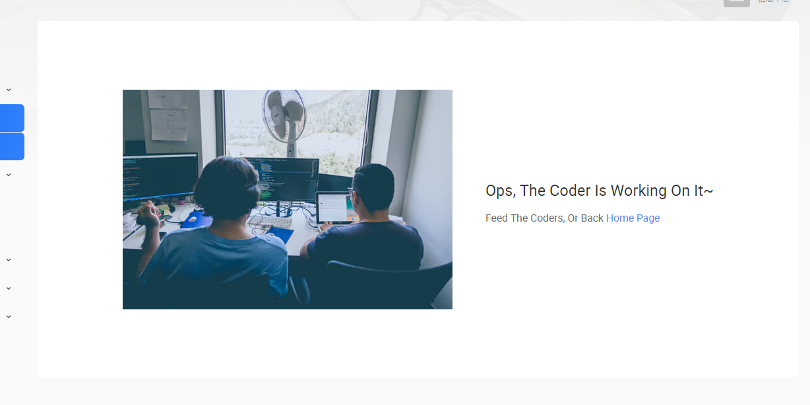

## (2019-05-27)
ADD:
- 添加一个告警的查询列表


## v1.0.1 (2019-03-13)
Change:
- Docker image based: `nginx:1.15-alpine` replaced by `nginx`. The image size reduce from `118MB` > `25MB` .


## v1.0.1 (2019-02-27)
Add:
- Show NB Status
- Show Lastes Commuinity Time.

## v1.0.0 (2018-09-04)
Add:
- Trouble
- Worksheet

TODO:
- Create Worksheet

## v1.0.0 (2018-08-29)
Add:
- DeviceSetting
  - Temperature Max-Min Setting

## v1.0.0 (2018-08-10)
Done:
- DevicePanel
  - Tab: Control History

  

## v1.0.0 (2018-08-08)
Component:
- DevicePanel
  get registers' latest info and metadata after didMount event. change panel router /panel/:sn


## v1.0.0 (2018-05-17)

Feature:
- Add `WorkingOn` Component, It looks like:
  

- Remove `/setting/basic` & `setting/navigation` & `/devices/update`


## v1.0.1(2018-7-5)
Feature:
- Add AddDevice 
- Add Kpi Statistics

Components:
- AddDevies Components
- Kpi Components

## v1.0.0 (2018-05-17)

Feature:
- Add SearchBar For AreaSetting & UserList

Components:
- SearchBar

## v0.0.1 (2018-05-15)

Feature:
- Add Pagination For AreaSetting

Components:
- Dialogs.CreateDialog
- Dialogs.EditDialog


## v0.0.1 (2018-05-08)

Components:
- Balloons.DeleteBalloon
- Balloons.DisableBalloon
- Balloons.EnableBalloon

Feature
- Add `User.Create` 
- Add `User.toggleEnable`

TODO
- Add Pagination

## v0.0.1 (2018-05-07)

Feature
- Add `User.ChangePassword` 


## v0.0.1 (2018-05-04)

Feature
  - Monitor map

   - Add Deps
     - Add `react-iframe` For display map in react
     
## 0.0.1 (2018-05-02)

Feature
- Area Manager

## v0.0.1 (2018-04-27)

Feature
- Subscribe Data From Server
  
  - Add Deps
    - Add `pubsub-js` For Pub/Sub Events
    - Add `socket.io-client` For Receiving Message From Server By Socket.io
   
  - Code Like
    ```javascript
    import PubSub from 'pubsub-js';

    // subscribe the event, The Topic Should Deal With The Hardware Engineer
    PubSub.subscribe('heartbeat', data => {
        console.log(data);
    })
    ```

Files
- Add `ISUESS.md` for isuess record

## v0.0.1 (2018-04-26)

Feature
  - Login